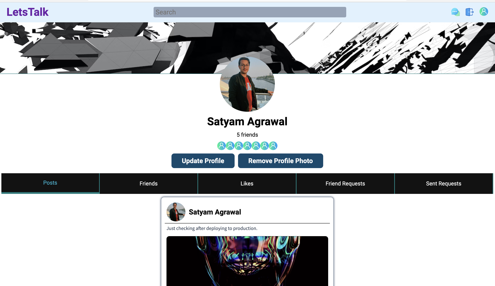
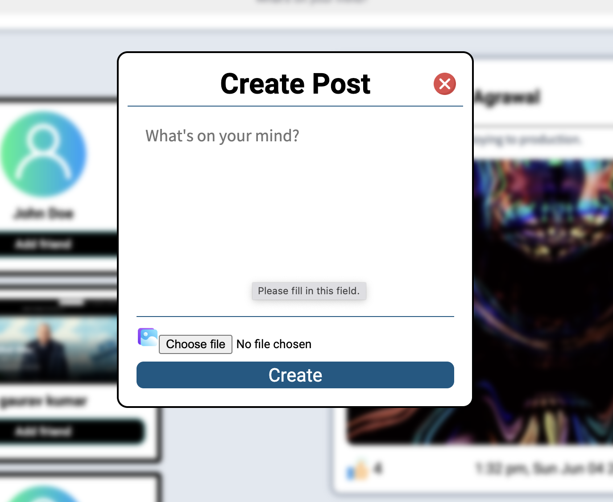
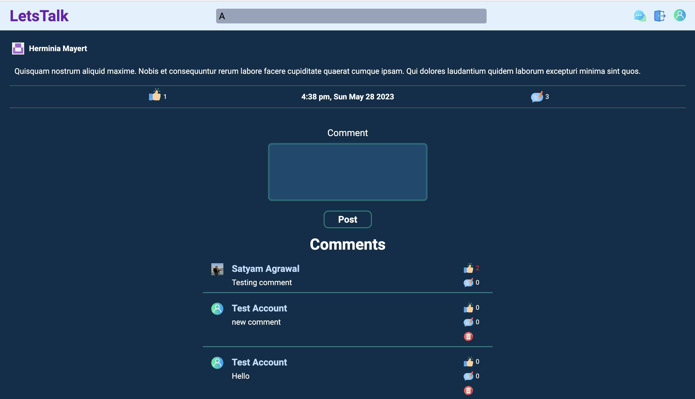
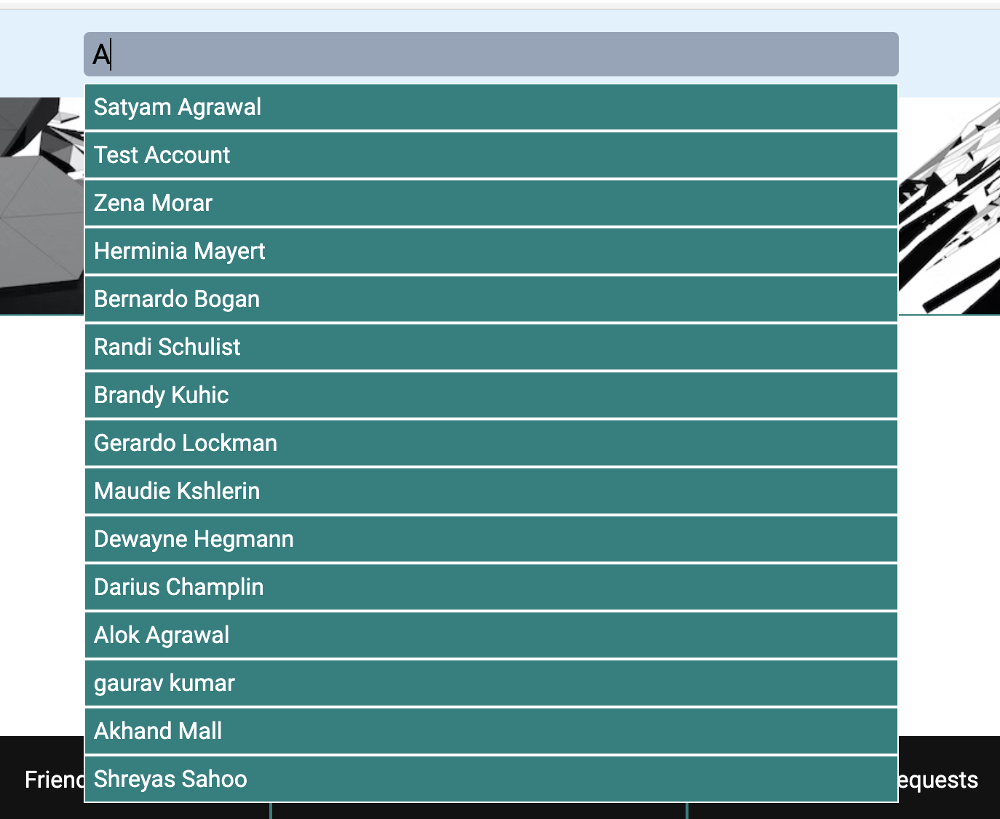

[Front-end Repository](https://github.com/Asatyam/SocialNetwork)
<br>[Back-end Repository](https://github.com/Asatyam/SocialNetworkAPI)
<br>

# Social Network - A social media app

Social Network is an app to share posts and make friends.
Some of the features of the website are:

- Implement sign up and login through PassportJS
- Use JWT for user authentication
- Users can create posts
- Users can add like posts and add comments to it.
- Users can like posts as well as comments.
- Users can add image to their posts
- Users can send and accept other users' friend requests.
- Home page shows all the posts shared by the user and their friends sorted by date.
- User's profile page shows all the posts and friends of the user
- User can update their profile, including adding and removing profile photos.
- User can see all the posts liked by them.
- Users can see all the recieved and sent friend requests.
- Home page also shows 10 new users to make new friends.
- Search for other users.

## TECH STACK
- MongoDB
- ExpressJS
- ReactJS
- NodeJS
- NextJS
- CSS3 
- HTML5

## Other important libraries
- PassportJS for authentication
- Mongoose as ORM for MongoDB
- Multer and Cloudinary for uploading images
- JWT for verifying user's identity
- axios for calling APIs from the front-end
- bcryptjs for hashing the password
- CORS
- dotenv for accessing environment variables 
- express-validator for verifying user inputs at the server side


## Screenshots





## Social Network - A social media app


This is a [Next.js](https://nextjs.org/) project bootstrapped with [`create-next-app`](https://github.com/vercel/next.js/tree/canary/packages/create-next-app).

## Getting Started

First, run the development server:

```bash
npm run dev
# or
yarn dev
# or
pnpm dev
```

Open [http://localhost:3000](http://localhost:3000) with your browser to see the result.

You can start editing the page by modifying `pages/index.js`. The page auto-updates as you edit the file.

[API routes](https://nextjs.org/docs/api-routes/introduction) can be accessed on [http://localhost:3000/api/hello](http://localhost:3000/api/hello). This endpoint can be edited in `pages/api/hello.js`.

The `pages/api` directory is mapped to `/api/*`. Files in this directory are treated as [API routes](https://nextjs.org/docs/api-routes/introduction) instead of React pages.

This project uses [`next/font`](https://nextjs.org/docs/basic-features/font-optimization) to automatically optimize and load Inter, a custom Google Font.

## Learn More

To learn more about Next.js, take a look at the following resources:

- [Next.js Documentation](https://nextjs.org/docs) - learn about Next.js features and API.
- [Learn Next.js](https://nextjs.org/learn) - an interactive Next.js tutorial.

You can check out [the Next.js GitHub repository](https://github.com/vercel/next.js/) - your feedback and contributions are welcome!

## Deploy on Vercel

The easiest way to deploy your Next.js app is to use the [Vercel Platform](https://vercel.com/new?utm_medium=default-template&filter=next.js&utm_source=create-next-app&utm_campaign=create-next-app-readme) from the creators of Next.js.

Check out our [Next.js deployment documentation](https://nextjs.org/docs/deployment) for more details.
